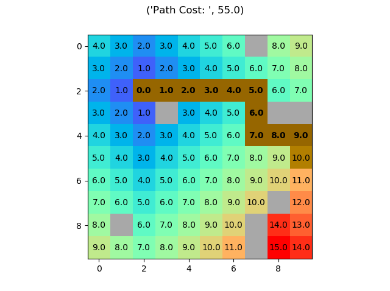
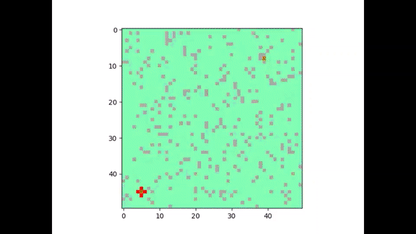

# Pathfinder-Project

This is a Pathfinder algorithm project developed in python. It is still on an initial phase, therefore, it may contain some bugs and besides has lots of room for improvements

To run the program, create the object and for a quick run, call the method .run(). 


```python
Example

# Initialization

shape = 10 # Defines a 10 x 10 maze 
start = (2,2) # Start point
end = (5,9) # End Point
numberWalls = 10 # Defines number of random walls created

maze = pathFinder.PathFinderClass(shape,start,end) # Initializes object
example1 = maze.run(numberWalls,False) # Calling the run function
example1["finalMap"].show() # Ploting Path and Maze
```
Below is the result's plot. Walls are colored in gray and best Path in brown:



Below is Exemplified a 50 by 50 maze as a gif:


For more references, try Dijkstra algorithm, A* search etc.
